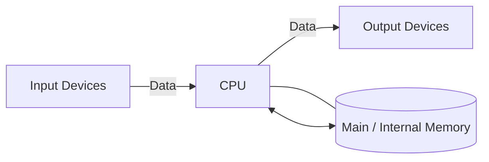
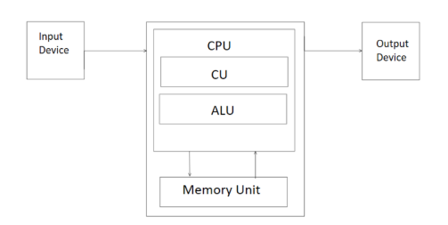
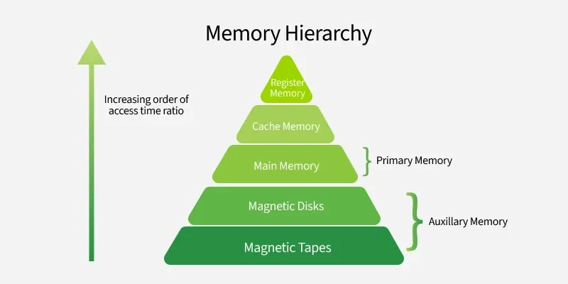

### *Module 1*
# 1. Computer System Concepts
## 1.1) What is a Computer?

A computer is an electronic device that can accept data as input, process it according to a set of instructions (called a program), and produce useful output. At its core, a computer performs mathematical and logical operations at very high speeds, making it a valuable tool for solving difficult problems, storing large amounts of information, and doing repetitive tasks automatically.

### 1.2) Characteristics of a Computer System

- **Speed:** Computers can perform millions (or even billions) of calculations in a fraction of a second. This is far beyond human capability. For example, a complex weather forecast that would take a human months to calculate can be done by a supercomputer in minutes. 
    
- **Accuracy:** Computers are incredibly accurate. If the input data and the instructions (the program) are correct, the output will be 100% correct. Any errors are almost always due to human error in the input or programming. 
    
- **Diligence:** Unlike humans, computers are immune to tiredness, boredom, and lack of concentration. They can work continuously for hours without making any errors. This makes them ideal for repetitive and tedious tasks. tireless
    
- **Versatility:** Computers are multi-purpose machines. They can perform a wide variety of tasks. The same computer can be used for playing games, watching movies, sending emails, creating documents, and much more. 
    
- **Storage Capacity:** Computers can store vast amounts of information in a very small space. This information can be retrieved almost instantly whenever needed. This is a huge advantage over traditional paper-based storage. 
    
- **Automation:** Once a program is in the computer's memory, the computer can execute it without any human involvement. This ability to automate tasks is a key feature of computers.
    
- **Reliability:** Modern electronic components have long lives and computers are designed to be reliable. They can perform the same type of task repeatedly with the same accuracy. 

### 1.3) Capabilities and Limitations of a Computer System

**Capabilities:**

- **Complex Calculations:** Computers are very good at doing complex mathematical and logical operations that would be hard or impossible for humans to do.
    
- **Data Processing:** They can process large volumes of data quickly and efficiently, identifying patterns and trends that might be missed by humans.
    
- **Communication:** Computers have transformed communication, making it possible for people to connect instantly anywhere in the world through the internet.
    
- **Entertainment:** They provide a wide range of entertainment options, from gaming and movies to music and social media.
    

**Limitations:**

- **No IQ:** A computer is a machine and has no intelligence of its own. It cannot think or make decisions on its own. It can only follow the instructions given to it. 
    
- **Dependency on Power:** Computers are electronic devices and are dependent on a power source to function.
    
- **No Feelings or Emotions:** Computers do not have feelings or emotions. They cannot make decisions based on gut feeling or personal experience.
    
- **Susceptibility to Viruses:** Computers are vulnerable to viruses and other malware, which can corrupt data and disrupt their functioning.

### 1.4) Generations of Computers

- **First Generation (1940-1956): Vacuum Tubes**
    
    - **Technology:** These early computers used **vacuum tubes** for circuitry and **magnetic drums** for memory.
        
    - **Characteristics:** They were enormous, taking up entire rooms. They were also very expensive to operate, used a great deal of electricity, and generated a lot of heat, which often caused malfunctions.
        
- **Second Generation (1956-1963): Transistors**
    
    - **Technology:** **Transistors** replaced vacuum tubes. Transistors were a major breakthrough as they were smaller, faster, cheaper, more energy-efficient, and more reliable than vacuum tubes.
        
    - **Characteristics:** Second-generation computers were smaller, faster, and more reliable than the first generation. They also moved from complex binary machine language to symbolic, which allowed programmers to write instructions using words instead of just numbers.
        
- **Third Generation (1964-1971): Integrated Circuits (IC)**
    
    - **Technology:** The development of the **IC** was the hallmark of this generation. ICs are small silicon chips that contain thousands of transistors.
        
    - **Characteristics:** The use of ICs made computers even smaller, faster, and more reliable. This generation also saw the development of **keyboards and monitors** and the use of **operating systems**, which allowed the computer to run many different programs at the same time.
        
- **Fourth Generation (1971-Present): Microprocessors**
    
    - **Technology:** The invention of the **microprocessor** brought the fourth generation of computers. Thousands of integrated circuits were built onto a single silicon chip.
        
    - **Characteristics:** What once filled an entire room in the first generation could now fit in the palm of your hand. The microprocessor led to the creation of **personal computers (PCs)**. This generation also saw the development of **graphical user interfaces (GUIs)**, the **mouse**, and **handheld devices**.
        
- **Fifth Generation (Present and Beyond): Artificial Intelligence (AI)** 
    
    - **Technology:** Fifth-generation computing is based on **AI**.
        
    - **Characteristics:** These computers are still developing, but many features are already in use today, such as **voice recognition, natural language processing, and machine learning**. The ultimate goal is to build systems that can learn independently, solve problems creatively, and interact with users in a more natural, human-like way.

### 1.5) Types of Computers

- **Supercomputers:**
    
    - **Characteristics:** The biggest and fastest computers. They are designed to process huge amounts of data. A supercomputer can process trillions of instructions in a second.
        
    - **Purpose:** Used for scientific and engineering applications such as weather forecasting, scientific simulations, and nuclear energy research.
        
- **Mainframe Computers:**
    
    - **Characteristics:** Large and expensive computers capable of supporting hundreds, or even thousands, of users simultaneously.
        
    - **Purpose:** Used by large organizations like banks, airlines, and universities for critical applications, bulk data processing, and transaction processing.
        
- **Minicomputers (Midrange Computers):**
    
    - **Characteristics:** These are medium-sized computers that fall between mainframes and personal computers in terms of power and capacity. They can handle multiple tasks and support many users working at the same time.
        
    - **Purpose:** Used as servers in a networked environment.
        
- **Workstations:**
    
    - **Characteristics:** Powerful, single-user computers. They have a more powerful microprocessor, a larger amount of RAM, and higher-quality monitors than a personal computer.
        
    - **Purpose:** Used for specialized applications such as desktop publishing, software development, and engineering design.
        
- **Personal Computers (PCs):**
    
    - **Characteristics:** Small, relatively inexpensive computers designed for an individual user.
        
    - **Types:**
        
        - **Desktop Computers:** Designed to be placed on a desk.
            
        - **Laptops:** Portable computers with a built-in screen and keyboard.
            
        - **Tablets:** Portable computers that are even smaller than laptops and use a touch screen as their primary input device.
            
        - **Smartphones:** Handheld computers that combine the features of a personal computer with a mobile phone.
            
- **Embedded Computers:**
    
    - **Characteristics:** Small, specialized computers that are part of a larger system or machine.
        
    - **Purpose:** Designed to perform a specific task.
        
    - **Examples:** Found in a wide variety of devices, including cars, microwaves, and digital watches.

|Computer Type|Size|Speed|Cost|Typical Users|
|---|---|---|---|---|
|Supercomputer|Very Large|Extremely Fast|Very High|Scientists, Engineers|
|Mainframe|Large|Very Fast|High|Large Organizations|
|Minicomputer|Medium|Fast|Medium|Small Businesses, Departments|
|PC|Small|Varies|Low|Individuals, Homes, Offices|

### 1.6) Functional Units of a Computer System

### 1.7) Central Processing Unit (CPU) - The Brain 

The **CPU** is called **_the brain of computer_** as it controls operation of all parts of computer. It consists of two components:

- **Arithmetic Logic Unit (ALU):** The ALU is the **digital calculator** and **decision-maker** of the computer. It's the part of the CPU that actually performs the calculations and comparisons.
    
    - **Function:** The ALU performs all the arithmetic and logical operations.
        
    - **Arithmetic Operations:** These include addition (+), subtraction (-), multiplication (*), and division (/).
        
    - **Logical Operations:** These include comparisons like less than (<), greater than (>), equal to (=), etc. All calculations and decisions are made in the ALU.
        
- **Control Unit (CU):** It doesn't perform any actual data processing but instead manages and coordinates all the activities within the computer. 
    
    - **Function:** The CU acts like the nervous system of the computer. It doesn't process data itself but manages and coordinates the activities of all the other units of the computer.
        
    - **Characteristics:** It fetches instructions from the memory, decodes them, and directs the flow of data between the CPU, memory, and I/O devices. It controls the timing of operations and ensures that all tasks are executed in the correct sequence.
 

### 1.8) The Memory Hierarchy

- **Top of the Pyramid:** Fastest speed, smallest capacity, highest cost.
    
- **Bottom of the Pyramid:** Slowest speed, largest capacity, lowest cost.

###  1.9) Registers

- **What they are:** Registers are the **smallest and fastest** memory locations available in a computer system. They are not part of the main memory but are located directly on the CPU chip itself.
    
- **Function:** They hold the data, instructions, and addresses that the CPU is currently working on. Because they are on the same chip, the CPU can access them almost instantaneously.
    
- **Analogy:** Think of registers as the hands of a chef. They hold the exact ingredients (data) the chef is working with at that very moment.

### 1.10) Cache Memory

- **What it is:** Cache is a small, extremely fast, and expensive memory that sits between the CPU and the main RAM.
    
- **Function:** Its purpose is to store copies of the data and instructions from RAM that are most frequently used by the CPU. When the CPU needs data, it first checks the cache. This process significantly speeds up the overall system performance.

### 1.11) RAM - Random Access Memory

**RAM** is the computer’s main memory where it keeps data it’s actively using. It’s called “Random Access” because the CPU can quickly reach any spot in RAM directly, without going step by step.

#### Characteristics of RAM

- **Volatile:** RAM is **volatile**, meaning it requires power to maintain the stored information. If the computer is turned off, all data in RAM is lost.
    
- **Read/Write Memory:** You can both write data to and read data from RAM.
    
- **Speed:** Much faster than secondary storage (like an HDD) but slower than cache and registers.
    

#### Types of RAM

RAM is broadly divided into two main types: SRAM and DRAM.

| Feature            | **SRAM (Static RAM)**                      | **DRAM (Dynamic RAM)**                                                                         |
| ------------------ | ------------------------------------------ | ---------------------------------------------------------------------------------------------- |
| **Technology**     | Uses flip-flops to store each bit.         | Uses a transistor and a capacitor to store each bit.                                           |
| **Speed**          | **Faster**. Does not need to be refreshed. | **Slower**. The capacitor leaks charge, so it must be refreshed thousands of times per second. |
| **Size & Density** | Less dense. Takes up more space per bit.   | More dense. Can store more bits in the same physical space.                                    |
| **Cost**           | **More expensive**.                        | **Less expensive**.                                                                            |
| **Power Usage**    | Consumes more power when idle.             | Consumes less power.                                                                           |
| **Typical Use**    | **Cache Memory**                           | **Main System Memory**                                                                         |

#### Pros and Cons of RAM

- **Pros:**
    
    - **Fast Access:** Allows for quick retrieval and storage of data, which is crucial for running applications smoothly.
        
    - **Essential for Multitasking:** More RAM allows the computer to run more programs simultaneously without slowing down.
        
- **Cons:**
    
    - **Volatile:** Data loss on power off.
        
    - **Limited Capacity:** Compared to secondary storage, it has a much smaller capacity.
        
    - **Cost:** More expensive per gigabyte than secondary storage.

### 1.12) ROM - Read-Only Memory

**ROM** is a type of non-volatile memory. The data stored in ROM is permanent and does not get erased when the computer is turned off.

#### Characteristics of ROM

- **Non-Volatile:** Retains its contents even when the power is off.
    
- **Read-Only:** As the name suggests, under normal operation, data can only be read from ROM. It cannot be easily changed or written to.
    
- **Function:** It is primarily used to store the **firmware** for the computer, which includes the **BIOS (Basic Input/Output System)** or **UEFI (Unified Extensible Firmware Interface)**. This is the initial program that runs when the computer is turned on, responsible for starting the computer, testing the hardware, and loading the operating system.
    

#### Types of ROM

- **ROM:** The very first type. Data is written onto it during the manufacturing process and can never be changed.
    
- **PROM (Programmable ROM):** Can be programmed **once** by the user with a special tool. After it's programmed, it cannot be erased or changed.
    
- **EPROM (Erasable and Programmable ROM):** Can be erased by exposing it to strong **ultraviolet light** for a period of time, after which it can be reprogrammed.
    
- **EEPROM (Electrically Erasable and Programmable ROM):** Can be erased and reprogrammed **electrically** without removing it from the computer. This is the most flexible type of ROM and is used for storing the BIOS in most modern computers, allowing for easy updates. **Flash memory**, used in SSDs and USB drives, is a type of EEPROM.

### 1.13) Input/Output (I/O) & Storage Units

**Input Devices:** These are the devices used to provide data and control signals to a computer.

- **Keyboard:** The most common input device, used for typing text and commands.
    
- **Mouse:** A pointing device used to interact with graphical user interfaces (GUIs).
    
- **Trackball & Joystick:** Pointing devices often used for gaming.
    
- **Light Pen & Touch Screen:** Devices that allow users to interact with the computer by touching the screen directly.
    
- **Scanners & Digital Cameras:** Used to convert physical images or documents into digital format.
    
- **Barcode Reader:** Scans barcodes to read product information.
    
- **MICR (Magnetic Ink Character Recognition):** Used by banks to read information on checks.
    
- **OCR (Optical Character Recognition):** Converts scanned images of text into editable text.
    
- **OMR (Optical Mark Recognition):** Reads marks made on pre-defined positions on a paper, commonly used for multiple-choice tests.
    
- **Voice Recognition (Microphone):** Captures audio and converts it into digital data.
    

**Output Devices:** These devices display the processed information from the computer.

- **Monitors (Visual Display Unit - VDU):** The primary output device for displaying visual information.
    
    - **Characteristics:**
        
        - **Size:** Measured diagonally across the screen.
            
        - **Resolution:** The number of pixels on the screen (e.g., 1920x1080). Higher resolution means a sharper image.
            
        - **Refresh Rate:** The number of times per second the screen image is redrawn, measured in Hertz (Hz). A higher refresh rate results in smoother motion.
            
        - **Dot Pitch:** The distance between the pixels on the screen. A smaller dot pitch means a sharper image.
            
    - **Video Standards:** Determine the resolution and color depth (e.g., **VGA**, **SVGA**, **XGA**).
        
- **Printers:** Produce a hard copy of documents.
    
    - **Impact Printers:** (e.g., **Dot Matrix**, **Daisy Wheel**) Physically strike the paper to create an image. They are noisy and produce lower quality output.
        
    - **Non-Impact Printers:** (e.g., **Inkjet**, **Laser**) Do not physically touch the paper. They are faster, quieter, and produce higher quality output.
        
    - **Line Printer:** A type of impact printer that prints an entire line at a time.
        
    - **Plotter:** Used to print vector graphics, often for engineering drawings and architectural blueprints.
        
- **Sound Card and Speakers:** The sound card converts digital audio signals into analog signals that can be played through speakers.

# QUICK NOTES 
#### **1. Computer System Concepts**

- **Computer:** An electronic device that takes input, processes it based on instructions, and produces output.
    
- **Core Characteristics:**
    
    - **Speed:** Performs millions of calculations per second.
        
    - **Accuracy:** 100% correct if input and program are correct.
        
    - **Diligence:** Can work continuously without getting tired or making errors.
        
    - **Versatility:** Can perform many different tasks.
        
    - **Storage:** Can store huge amounts of data in a small space.
        
    - **Automation:** Can run programs without human intervention.
        
- **Limitations:**
    
    - **No IQ:** Cannot think or make decisions on its own.
        
    - **Needs Power:** Dependent on electricity.
        
    - **No Feelings:** Cannot make emotional or intuitive judgments.
        

---

#### **2. Generations of Computers**

- **First Gen (1940-1956):** **Vacuum Tubes**. Huge, expensive, generated a lot of heat.
    
- **Second Gen (1956-1963):** **Transistors**. Smaller, faster, cheaper, and more reliable than vacuum tubes.
    
- **Third Gen (1964-1971):** **Integrated Circuits (ICs)**. Introduced keyboards, monitors, and operating systems.
    
- **Fourth Gen (1971-Present):** **Microprocessors**. Led to Personal Computers (PCs), GUIs, and the mouse.
    
- **Fifth Gen (Present & Beyond):** **Artificial Intelligence (AI)**. Focuses on voice recognition, machine learning, and natural language processing.
    

---

#### **3. Types of Computers**

|Computer Type|Key Feature|Primary Use|
|---|---|---|
|**Supercomputer**|Biggest and fastest; trillions of instructions/sec.|Scientific research, weather forecasting.|
|**Mainframe**|Supports thousands of users simultaneously.|Banks, airlines for bulk data processing.|
|**Minicomputer**|Medium-sized; server in a network environment.|Small businesses, departments.|
|**PC**|Small, inexpensive, for a single user.|Homes and offices (Desktops, Laptops).|

---

#### **4. Functional Units**

- **Flow:** Input Devices → CPU (Central Processing Unit) → Output Devices.
    
- The **CPU** communicates constantly with **Memory**.
    

#### **5. Central Processing Unit (CPU) - The Brain**

The CPU controls all computer operations and has two main parts:

1. **Arithmetic Logic Unit (ALU):**
    
    - The "digital calculator" of the CPU.
        
    - Performs all arithmetic (+, -, *, /) and logical (<, >, =) operations.
        
2. **Control Unit (CU):**
    
    - The "nervous system" of the computer.
        
    - Manages and coordinates all other units. It fetches, decodes, and executes instructions.
        

---

#### **6. Memory**

**Memory Hierarchy:**

- **Top (Fastest, Smallest, Most Expensive):** Registers
    
- **Middle:** Cache, RAM (Main Memory)
    
- **Bottom (Slowest, Largest, Cheapest):** Secondary Storage (HDD/SSD)
    

**Registers:**

- Smallest and fastest memory, located directly on the CPU.
    
- Holds data the CPU is _currently_ working on.
    

**Cache Memory:**

- Small, very fast memory between the CPU and RAM.
    
- Stores frequently used data from RAM to speed up access.
    

**RAM (Random Access Memory):**

- **Main Memory**.
    
- **Volatile:** Loses all data when power is turned off.
    
- **Read/Write:** Data can be read from and written to it.
    
- **Types:**
    

|Feature|**SRAM (Static RAM)**|**DRAM (Dynamic RAM)**|
|---|---|---|
|**Speed**|Faster.|Slower, needs refreshing.|
|**Cost**|More Expensive.|Less Expensive.|
|**Use**|**Cache Memory**.|**Main Memory**.|

**ROM (Read-Only Memory):**

- **Non-Volatile:** Keeps data even when power is off.
    
- **Read-Only:** Data cannot be easily changed in normal operation.
    
- **Function:** Stores the computer's startup instructions (BIOS/UEFI).
    
- **Types:**
    
    - **PROM:** Programmable **once**.
        
    - **EPROM:** Erasable with **UV light**.
        
    - **EEPROM:** **Electrically** erasable. Modern BIOS and Flash memory are this type.
        

---

#### **7. Input/Output (I/O) Devices**

- **Input Devices:** Provide data _to_ the computer.
    
    - **Examples:** Keyboard, Mouse, Scanner, Microphone, Barcode Reader, Touch Screen.
        
- **Output Devices:** Display processed information _from_ the computer.
    
    - **Examples:** Monitor (VDU), Printer, Speakers, Plotter.
