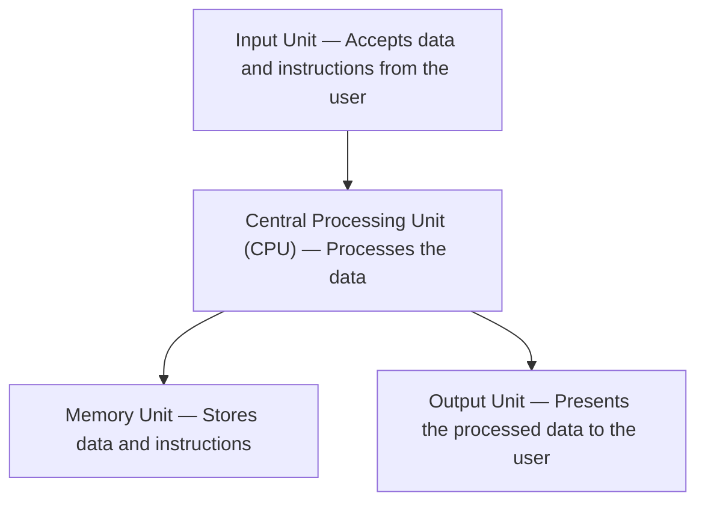
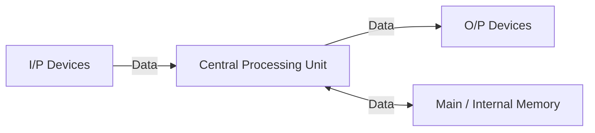

### *Module 1*
# 1. Computer System Concepts
## 1.1) What is a Computer?

A computer is an electronic device that can accept data as input, process it according to a set of instructions (called a program), and produce useful output. At its core, a computer performs mathematical and logical operations at very high speeds, making it a valuable tool for solving difficult problems, storing large amounts of information, and doing repetitive tasks automatically.

### 1.2) Characteristics of a Computer System

- **Speed:** Computers can perform millions (or even billions) of calculations in a fraction of a second. This is far beyond human capability. For example, a complex weather forecast that would take a human months to calculate can be done by a supercomputer in minutes. 
    
- **Accuracy:** Computers are incredibly accurate. If the input data and the instructions (the program) are correct, the output will be 100% correct. Any errors are almost always due to human error in the input or programming. 
    
- **Diligence:** Unlike humans, computers are immune to tiredness, boredom, and lack of concentration. They can work continuously for hours without making any errors. This makes them ideal for repetitive and tedious tasks. tireless
    
- **Versatility:** Computers are multi-purpose machines. They can perform a wide variety of tasks. The same computer can be used for playing games, watching movies, sending emails, creating documents, and much more. 
    
- **Storage Capacity:** Computers can store vast amounts of information in a very small space. This information can be retrieved almost instantly whenever needed. This is a huge advantage over traditional paper-based storage. 
    
- **Automation:** Once a program is in the computer's memory, the computer can execute it without any human involvement. This ability to automate tasks is a key feature of computers.
    
- **Reliability:** Modern electronic components have long lives and computers are designed to be reliable. They can perform the same type of task repeatedly with the same accuracy. 

### 1.3) Capabilities and Limitations of a Computer System

**Capabilities:**

- **Complex Calculations:** Computers are very good at doing complex mathematical and logical operations that would be hard or impossible for humans to do.
    
- **Data Processing:** They can process large volumes of data quickly and efficiently, identifying patterns and trends that might be missed by humans.
    
- **Communication:** Computers have transformed communication, making it possible for people to connect instantly anywhere in the world through the internet.
    
- **Entertainment:** They provide a wide range of entertainment options, from gaming and movies to music and social media.
    

**Limitations:**

- **No IQ:** A computer is a machine and has no intelligence of its own. It cannot think or make decisions on its own. It can only follow the instructions given to it. 
    
- **Dependency on Power:** Computers are electronic devices and are dependent on a power source to function.
    
- **No Feelings or Emotions:** Computers do not have feelings or emotions. They cannot make decisions based on gut feeling or personal experience.
    
- **Susceptibility to Viruses:** Computers are vulnerable to viruses and other malware, which can corrupt data and disrupt their functioning.

### 1.4) Generations of Computers

- **First Generation (1940-1956): Vacuum Tubes**
    
    - **Technology:** These early computers used **vacuum tubes** for circuitry and **magnetic drums** for memory.
        
    - **Characteristics:** They were enormous, taking up entire rooms. They were also very expensive to operate, used a great deal of electricity, and generated a lot of heat, which often caused malfunctions.
        
- **Second Generation (1956-1963): Transistors**
    
    - **Technology:** **Transistors** replaced vacuum tubes. Transistors were a major breakthrough as they were smaller, faster, cheaper, more energy-efficient, and more reliable than vacuum tubes.
        
    - **Characteristics:** Second-generation computers were smaller, faster, and more reliable than the first generation. They also moved from complex binary machine language to symbolic, or **a2.2 Types of Computers
ssembly languages**, which allowed programmers to write instructions using words instead of just numbers.
        
- **Third Generation (1964-1971): Integrated Circuits (IC)**
    
    - **Technology:** The development of the **IC** was the hallmark of this generation. ICs are small silicon chips that contain thousands of transistors.
        
    - **Characteristics:** The use of ICs made computers even smaller, faster, and more reliable. This generation also saw the development of **keyboards and monitors** and the use of **operating systems**, which allowed the computer to run many different programs at the same time.
        
- **Fourth Generation (1971-Present): Microprocessors**
    
    - **Technology:** The invention of the **microprocessor** brought the fourth generation of computers. Thousands of integrated circuits were built onto a single silicon chip.
        
    - **Characteristics:** What once filled an entire room in the first generation could now fit in the palm of your hand. The microprocessor led to the creation of **personal computers (PCs)**. This generation also saw the development of **graphical user interfaces (GUIs)**, the **mouse**, and **handheld devices**.
        
- **Fifth Generation (Present and Beyond): Artificial Intelligence (AI)** 
    
    - **Technology:** Fifth-generation computing is based on **AI**.
        
    - **Characteristics:** These computers are still developing, but many features are already in use today, such as **voice recognition, natural language processing, and machine learning**. The ultimate goal is to build systems that can learn independently, solve problems creatively, and interact with users in a more natural, human-like way.

### 1.5) Types of Computers

- **Supercomputers:**
    
    - **Characteristics:** The biggest and fastest computers. They are designed to process huge amounts of data. A supercomputer can process trillions of instructions in a second.
        
    - **Purpose:** Used for scientific and engineering applications such as weather forecasting, scientific simulations, and nuclear energy research.
        
- **Mainframe Computers:**
    
    - **Characteristics:** Large and expensive computers capable of supporting hundreds, or even thousands, of users simultaneously.
        
    - **Purpose:** Used by large organizations like banks, airlines, and universities for critical applications, bulk data processing, and transaction processing.
        
- **Minicomputers (Midrange Computers):**
    
    - **Characteristics:** These are medium-sized computers that fall between mainframes and personal computers in terms of power and capacity. They can handle multiple tasks and support many users working at the same time.
        
    - **Purpose:** Used as servers in a networked environment.
        
- **Workstations:**
    
    - **Characteristics:** Powerful, single-user computers. They have a more powerful microprocessor, a larger amount of RAM, and higher-quality monitors than a personal computer.
        
    - **Purpose:** Used for specialized applications such as desktop publishing, software development, and engineering design.
        
- **Personal Computers (PCs):**
    
    - **Characteristics:** Small, relatively inexpensive computers designed for an individual user.
        
    - **Types:**
        
        - **Desktop Computers:** Designed to be placed on a desk.
            
        - **Laptops:** Portable computers with a built-in screen and keyboard.
            
        - **Tablets:** Portable computers that are even smaller than laptops and use a touch screen as their primary input device.
            
        - **Smartphones:** Handheld computers that combine the features of a personal computer with a mobile phone.
            
- **Embedded Computers:**
    
    - **Characteristics:** Small, specialized computers that are part of a larger system or machine.
        
    - **Purpose:** Designed to perform a specific task.
        
    - **Examples:** Found in a wide variety of devices, including cars, microwaves, and digital watches.

|Computer Type|Size|Speed|Cost|Typical Users|
|---|---|---|---|---|
|Supercomputer|Very Large|Extremely Fast|Very High|Scientists, Engineers|
|Mainframe|Large|Very Fast|High|Large Organizations|
|Minicomputer|Medium|Fast|Medium|Small Businesses, Departments|
|PC|Small|Varies|Low|Individuals, Homes, Offices|

### 1.6) Functional Units of a Computer System

