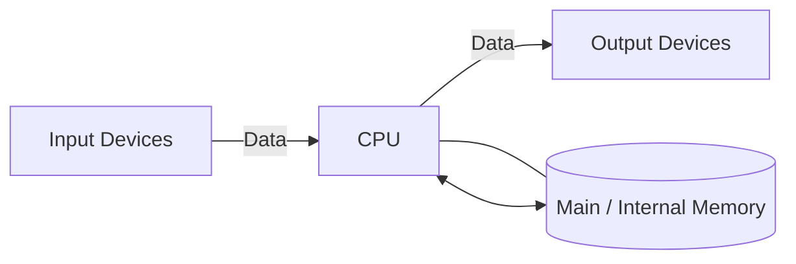

### *Module 1*
# 1. Computer System Concepts
## 1.1) What is a Computer?

A computer is an electronic device that can accept data as input, process it according to a set of instructions (called a program), and produce useful output. At its core, a computer performs mathematical and logical operations at very high speeds, making it a valuable tool for solving difficult problems, storing large amounts of information, and doing repetitive tasks automatically.

### 1.2) Characteristics of a Computer System

- **Speed:** Computers can perform millions (or even billions) of calculations in a fraction of a second. This is far beyond human capability. For example, a complex weather forecast that would take a human months to calculate can be done by a supercomputer in minutes. 
    
- **Accuracy:** Computers are incredibly accurate. If the input data and the instructions (the program) are correct, the output will be 100% correct. Any errors are almost always due to human error in the input or programming. 
    
- **Diligence:** Unlike humans, computers are immune to tiredness, boredom, and lack of concentration. They can work continuously for hours without making any errors. This makes them ideal for repetitive and tedious tasks. tireless
    
- **Versatility:** Computers are multi-purpose machines. They can perform a wide variety of tasks. The same computer can be used for playing games, watching movies, sending emails, creating documents, and much more. 
    
- **Storage Capacity:** Computers can store vast amounts of information in a very small space. This information can be retrieved almost instantly whenever needed. This is a huge advantage over traditional paper-based storage. 
    
- **Automation:** Once a program is in the computer's memory, the computer can execute it without any human involvement. This ability to automate tasks is a key feature of computers.
    
- **Reliability:** Modern electronic components have long lives and computers are designed to be reliable. They can perform the same type of task repeatedly with the same accuracy. 

### 1.3) Capabilities and Limitations of a Computer System

**Capabilities:**

- **Complex Calculations:** Computers are very good at doing complex mathematical and logical operations that would be hard or impossible for humans to do.
    
- **Data Processing:** They can process large volumes of data quickly and efficiently, identifying patterns and trends that might be missed by humans.
    
- **Communication:** Computers have transformed communication, making it possible for people to connect instantly anywhere in the world through the internet.
    
- **Entertainment:** They provide a wide range of entertainment options, from gaming and movies to music and social media.
    

**Limitations:**

- **No IQ:** A computer is a machine and has no intelligence of its own. It cannot think or make decisions on its own. It can only follow the instructions given to it. 
    
- **Dependency on Power:** Computers are electronic devices and are dependent on a power source to function.
    
- **No Feelings or Emotions:** Computers do not have feelings or emotions. They cannot make decisions based on gut feeling or personal experience.
    
- **Susceptibility to Viruses:** Computers are vulnerable to viruses and other malware, which can corrupt data and disrupt their functioning.

### 1.4) Generations of Computers

- **First Generation (1940-1956): Vacuum Tubes**
    
    - **Technology:** These early computers used **vacuum tubes** for circuitry and **magnetic drums** for memory.
        
    - **Characteristics:** They were enormous, taking up entire rooms. They were also very expensive to operate, used a great deal of electricity, and generated a lot of heat, which often caused malfunctions.
        
- **Second Generation (1956-1963): Transistors**
    
    - **Technology:** **Transistors** replaced vacuum tubes. Transistors were a major breakthrough as they were smaller, faster, cheaper, more energy-efficient, and more reliable than vacuum tubes.
        
    - **Characteristics:** Second-generation computers were smaller, faster, and more reliable than the first generation. They also moved from complex binary machine language to symbolic, which allowed programmers to write instructions using words instead of just numbers.
        
- **Third Generation (1964-1971): Integrated Circuits (IC)**
    
    - **Technology:** The development of the **IC** was the hallmark of this generation. ICs are small silicon chips that contain thousands of transistors.
        
    - **Characteristics:** The use of ICs made computers even smaller, faster, and more reliable. This generation also saw the development of **keyboards and monitors** and the use of **operating systems**, which allowed the computer to run many different programs at the same time.
        
- **Fourth Generation (1971-Present): Microprocessors**
    
    - **Technology:** The invention of the **microprocessor** brought the fourth generation of computers. Thousands of integrated circuits were built onto a single silicon chip.
        
    - **Characteristics:** What once filled an entire room in the first generation could now fit in the palm of your hand. The microprocessor led to the creation of **personal computers (PCs)**. This generation also saw the development of **graphical user interfaces (GUIs)**, the **mouse**, and **handheld devices**.
        
- **Fifth Generation (Present and Beyond): Artificial Intelligence (AI)** 
    
    - **Technology:** Fifth-generation computing is based on **AI**.
        
    - **Characteristics:** These computers are still developing, but many features are already in use today, such as **voice recognition, natural language processing, and machine learning**. The ultimate goal is to build systems that can learn independently, solve problems creatively, and interact with users in a more natural, human-like way.

### 1.5) Types of Computers

- **Supercomputers:**
    
    - **Characteristics:** The biggest and fastest computers. They are designed to process huge amounts of data. A supercomputer can process trillions of instructions in a second.
        
    - **Purpose:** Used for scientific and engineering applications such as weather forecasting, scientific simulations, and nuclear energy research.
        
- **Mainframe Computers:**
    
    - **Characteristics:** Large and expensive computers capable of supporting hundreds, or even thousands, of users simultaneously.
        
    - **Purpose:** Used by large organizations like banks, airlines, and universities for critical applications, bulk data processing, and transaction processing.
        
- **Minicomputers (Midrange Computers):**
    
    - **Characteristics:** These are medium-sized computers that fall between mainframes and personal computers in terms of power and capacity. They can handle multiple tasks and support many users working at the same time.
        
    - **Purpose:** Used as servers in a networked environment.
        
- **Workstations:**
    
    - **Characteristics:** Powerful, single-user computers. They have a more powerful microprocessor, a larger amount of RAM, and higher-quality monitors than a personal computer.
        
    - **Purpose:** Used for specialized applications such as desktop publishing, software development, and engineering design.
        
- **Personal Computers (PCs):**
    
    - **Characteristics:** Small, relatively inexpensive computers designed for an individual user.
        
    - **Types:**
        
        - **Desktop Computers:** Designed to be placed on a desk.
            
        - **Laptops:** Portable computers with a built-in screen and keyboard.
            
        - **Tablets:** Portable computers that are even smaller than laptops and use a touch screen as their primary input device.
            
        - **Smartphones:** Handheld computers that combine the features of a personal computer with a mobile phone.
            
- **Embedded Computers:**
    
    - **Characteristics:** Small, specialized computers that are part of a larger system or machine.
        
    - **Purpose:** Designed to perform a specific task.
        
    - **Examples:** Found in a wide variety of devices, including cars, microwaves, and digital watches.

|Computer Type|Size|Speed|Cost|Typical Users|
|---|---|---|---|---|
|Supercomputer|Very Large|Extremely Fast|Very High|Scientists, Engineers|
|Mainframe|Large|Very Fast|High|Large Organizations|
|Minicomputer|Medium|Fast|Medium|Small Businesses, Departments|
|PC|Small|Varies|Low|Individuals, Homes, Offices|

### 1.6) Functional Units of a Computer System

### 1.7) Central Processing Unit (CPU) - The Brain 

The **CPU** is called **_the brain of computer_** as it controls operation of all parts of computer. It consists of two components:

- **Arithmetic Logic Unit (ALU):** The ALU is the **digital calculator** and **decision-maker** of the computer. It's the part of the CPU that actually performs the calculations and comparisons.
    
    - **Function:** The ALU performs all the arithmetic and logical operations.
        
    - **Arithmetic Operations:** These include addition (+), subtraction (-), multiplication (*), and division (/).
        
    - **Logical Operations:** These include comparisons like less than (<), greater than (>), equal to (=), etc. All calculations and decisions are made in the ALU.
        
- **Control Unit (CU):** It doesn't perform any actual data processing but instead manages and coordinates all the activities within the computer. 
    
    - **Function:** The CU acts like the nervous system of the computer. It doesn't process data itself but manages and coordinates the activities of all the other units of the computer.
        
    - **Characteristics:** It fetches instructions from the memory, decodes them, and directs the flow of data between the CPU, memory, and I/O devices. It controls the timing of operations and ensures that all tasks are executed in the correct sequence.
 

### 1.8) The Memory Hierarchy

- **Top of the Pyramid:** Fastest speed, smallest capacity, highest cost.
    
- **Bottom of the Pyramid:** Slowest speed, largest capacity, lowest cost.

###  1.9) Registers

- **What they are:** Registers are the **smallest and fastest** memory locations available in a computer system. They are not part of the main memory but are located directly on the CPU chip itself.
    
- **Function:** They hold the data, instructions, and addresses that the CPU is currently working on. Because they are on the same chip, the CPU can access them almost instantaneously.
    
- **Analogy:** Think of registers as the hands of a chef. They hold the exact ingredients (data) the chef is working with at that very moment.

### 1.10) Cache Memory

- **What it is:** Cache is a small, extremely fast, and expensive memory that sits between the CPU and the main RAM.
    
- **Function:** Its purpose is to store copies of the data and instructions from RAM that are most frequently used by the CPU. When the CPU needs data, it first checks the cache. This process significantly speeds up the overall system performance.

### 1.11) RAM - Random Access Memory

**RAM** is the computer’s main memory where it keeps data it’s actively using. It’s called “Random Access” because the CPU can quickly reach any spot in RAM directly, without going step by step.

#### Characteristics of RAM

- **Volatile:** RAM is **volatile**, meaning it requires power to maintain the stored information. If the computer is turned off, all data in RAM is lost.
    
- **Read/Write Memory:** You can both write data to and read data from RAM.
    
- **Speed:** Much faster than secondary storage (like an HDD) but slower than cache and registers.
    

#### Types of RAM

RAM is broadly divided into two main types: SRAM and DRAM.

| Feature            | **SRAM (Static RAM)**                      | **DRAM (Dynamic RAM)**                                                                         |
| ------------------ | ------------------------------------------ | ---------------------------------------------------------------------------------------------- |
| **Technology**     | Uses flip-flops to store each bit.         | Uses a transistor and a capacitor to store each bit.                                           |
| **Speed**          | **Faster**. Does not need to be refreshed. | **Slower**. The capacitor leaks charge, so it must be refreshed thousands of times per second. |
| **Size & Density** | Less dense. Takes up more space per bit.   | More dense. Can store more bits in the same physical space.                                    |
| **Cost**           | **More expensive**.                        | **Less expensive**.                                                                            |
| **Power Usage**    | Consumes more power when idle.             | Consumes less power.                                                                           |
| **Typical Use**    | **Cache Memory**                           | **Main System Memory**                                                                         |

#### Pros and Cons of RAM

- **Pros:**
    
    - **Fast Access:** Allows for quick retrieval and storage of data, which is crucial for running applications smoothly.
        
    - **Essential for Multitasking:** More RAM allows the computer to run more programs simultaneously without slowing down.
        
- **Cons:**
    
    - **Volatile:** Data loss on power off.
        
    - **Limited Capacity:** Compared to secondary storage, it has a much smaller capacity.
        
    - **Cost:** More expensive per gigabyte than secondary storage.

### 1.12) ROM - Read-Only Memory

**ROM** is a type of non-volatile memory. The data stored in ROM is permanent and does not get erased when the computer is turned off.

#### Characteristics of ROM

- **Non-Volatile:** Retains its contents even when the power is off.
    
- **Read-Only:** As the name suggests, under normal operation, data can only be read from ROM. It cannot be easily changed or written to.
    
- **Function:** It is primarily used to store the **firmware** for the computer, which includes the **BIOS (Basic Input/Output System)** or **UEFI (Unified Extensible Firmware Interface)**. This is the initial program that runs when the computer is turned on, responsible for starting the computer, testing the hardware, and loading the operating system.
    

#### Types of ROM

- **ROM:** The very first type. Data is written onto it during the manufacturing process and can never be changed.
    
- **PROM (Programmable ROM):** Can be programmed **once** by the user with a special tool. After it's programmed, it cannot be erased or changed.
    
- **EPROM (Erasable and Programmable ROM):** Can be erased by exposing it to strong **ultraviolet light** for a period of time, after which it can be reprogrammed.
    
- **EEPROM (Electrically Erasable and Programmable ROM):** Can be erased and reprogrammed **electrically** without removing it from the computer. This is the most flexible type of ROM and is used for storing the BIOS in most modern computers, allowing for easy updates. **Flash memory**, used in SSDs and USB drives, is a type of EEPROM.

### 1.13) Input/Output (I/O) & Storage Units

**Input Devices:** These are the devices used to provide data and control signals to a computer.

- **Keyboard:** The most common input device, used for typing text and commands.
    
- **Mouse:** A pointing device used to interact with graphical user interfaces (GUIs).
    
- **Trackball & Joystick:** Pointing devices often used for gaming.
    
- **Light Pen & Touch Screen:** Devices that allow users to interact with the computer by touching the screen directly.
    
- **Scanners & Digital Cameras:** Used to convert physical images or documents into digital format.
    
- **Barcode Reader:** Scans barcodes to read product information.
    
- **MICR (Magnetic Ink Character Recognition):** Used by banks to read information on checks.
    
- **OCR (Optical Character Recognition):** Converts scanned images of text into editable text.
    
- **OMR (Optical Mark Recognition):** Reads marks made on pre-defined positions on a paper, commonly used for multiple-choice tests.
    
- **Voice Recognition (Microphone):** Captures audio and converts it into digital data.
    

**Output Devices:** These devices display the processed information from the computer.

- **Monitors (Visual Display Unit - VDU):** The primary output device for displaying visual information.
    
    - **Characteristics:**
        
        - **Size:** Measured diagonally across the screen.
            
        - **Resolution:** The number of pixels on the screen (e.g., 1920x1080). Higher resolution means a sharper image.
            
        - **Refresh Rate:** The number of times per second the screen image is redrawn, measured in Hertz (Hz). A higher refresh rate results in smoother motion.
            
        - **Dot Pitch:** The distance between the pixels on the screen. A smaller dot pitch means a sharper image.
            
    - **Video Standards:** Determine the resolution and color depth (e.g., **VGA**, **SVGA**, **XGA**).
        
- **Printers:** Produce a hard copy of documents.
    
    - **Impact Printers:** (e.g., **Dot Matrix**, **Daisy Wheel**) Physically strike the paper to create an image. They are noisy and produce lower quality output.
        
    - **Non-Impact Printers:** (e.g., **Inkjet**, **Laser**) Do not physically touch the paper. They are faster, quieter, and produce higher quality output.
        
    - **Line Printer:** A type of impact printer that prints an entire line at a time.
        
    - **Plotter:** Used to print vector graphics, often for engineering drawings and architectural blueprints.
        
- **Sound Card and Speakers:** The sound card converts digital audio signals into analog signals that can be played through speakers.

# QUICK NOTES 
#### **1. Computer System Concepts**

- **Computer:** An electronic device that takes input, processes it based on instructions, and produces output.
    
- **Core Characteristics:**
    
    - **Speed:** Performs millions of calculations per second.
        
    - **Accuracy:** 100% correct if input and program are correct.
        
    - **Diligence:** Can work continuously without getting tired or making errors.
        
    - **Versatility:** Can perform many different tasks.
        
    - **Storage:** Can store huge amounts of data in a small space.
        
    - **Automation:** Can run programs without human intervention.
        
- **Limitations:**
    
    - **No IQ:** Cannot think or make decisions on its own.
        
    - **Needs Power:** Dependent on electricity.
        
    - **No Feelings:** Cannot make emotional or intuitive judgments.
        

---

#### **2. Generations of Computers**

- **First Gen (1940-1956):** **Vacuum Tubes**. Huge, expensive, generated a lot of heat.
    
- **Second Gen (1956-1963):** **Transistors**. Smaller, faster, cheaper, and more reliable than vacuum tubes.
    
- **Third Gen (1964-1971):** **Integrated Circuits (ICs)**. Introduced keyboards, monitors, and operating systems.
    
- **Fourth Gen (1971-Present):** **Microprocessors**. Led to Personal Computers (PCs), GUIs, and the mouse.
    
- **Fifth Gen (Present & Beyond):** **Artificial Intelligence (AI)**. Focuses on voice recognition, machine learning, and natural language processing.
    

---

#### **3. Types of Computers**

|Computer Type|Key Feature|Primary Use|
|---|---|---|
|**Supercomputer**|Biggest and fastest; trillions of instructions/sec.|Scientific research, weather forecasting.|
|**Mainframe**|Supports thousands of users simultaneously.|Banks, airlines for bulk data processing.|
|**Minicomputer**|Medium-sized; server in a network environment.|Small businesses, departments.|
|**PC**|Small, inexpensive, for a single user.|Homes and offices (Desktops, Laptops).|

---

#### **4. Functional Units**

- **Flow:** Input Devices → CPU (Central Processing Unit) → Output Devices.
    
- The **CPU** communicates constantly with **Memory**.
    

#### **5. Central Processing Unit (CPU) - The Brain**

The CPU controls all computer operations and has two main parts:

1. **Arithmetic Logic Unit (ALU):**
    
    - The "digital calculator" of the CPU.
        
    - Performs all arithmetic (+, -, *, /) and logical (<, >, =) operations.
        
2. **Control Unit (CU):**
    
    - The "nervous system" of the computer.
        
    - Manages and coordinates all other units. It fetches, decodes, and executes instructions.
        

---

#### **6. Memory**

**Memory Hierarchy:**

- **Top (Fastest, Smallest, Most Expensive):** Registers
    
- **Middle:** Cache, RAM (Main Memory)
    
- **Bottom (Slowest, Largest, Cheapest):** Secondary Storage (HDD/SSD)
    

**Registers:**

- Smallest and fastest memory, located directly on the CPU.
    
- Holds data the CPU is _currently_ working on.
    

**Cache Memory:**

- Small, very fast memory between the CPU and RAM.
    
- Stores frequently used data from RAM to speed up access.
    

**RAM (Random Access Memory):**

- **Main Memory**.
    
- **Volatile:** Loses all data when power is turned off.
    
- **Read/Write:** Data can be read from and written to it.
    
- **Types:**
    

|Feature|**SRAM (Static RAM)**|**DRAM (Dynamic RAM)**|
|---|---|---|
|**Speed**|Faster.|Slower, needs refreshing.|
|**Cost**|More Expensive.|Less Expensive.|
|**Use**|**Cache Memory**.|**Main Memory**.|

**ROM (Read-Only Memory):**

- **Non-Volatile:** Keeps data even when power is off.
    
- **Read-Only:** Data cannot be easily changed in normal operation.
    
- **Function:** Stores the computer's startup instructions (BIOS/UEFI).
    
- **Types:**
    
    - **PROM:** Programmable **once**.
        
    - **EPROM:** Erasable with **UV light**.
        
    - **EEPROM:** **Electrically** erasable. Modern BIOS and Flash memory are this type.
        

---

#### **7. Input/Output (I/O) Devices**

- **Input Devices:** Provide data _to_ the computer.
    
    - **Examples:** Keyboard, Mouse, Scanner, Microphone, Barcode Reader, Touch Screen.
        
- **Output Devices:** Display processed information _from_ the computer.
    
    - **Examples:** Monitor (VDU), Printer, Speakers, Plotter.
    - 

---
---
### *Module - 2*

## 2.1) Primary vs. Secondary Storage

| Feature               | Primary Storage                                                  | Secondary Storage                                                                                       |
| --------------------- | ---------------------------------------------------------------- | ------------------------------------------------------------------------------------------------------- |
| **Also Known As**     | Main memory, internal memory                                     | Auxiliary memory, external memory                                                                       |
| **Volatility**        | Volatile (data is lost when power is off)                        | Non-volatile (data is retained without power)                                                           |
| **Access Speed**      | Very fast                                                        | Slower than primary storage                                                                             |
| **CPU Accessibility** | Directly accessible by the CPU                                   | Not directly accessible by the CPU                                                                      |
| **Capacity**          | Smaller capacity                                                 | Larger capacity                                                                                         |
| **Cost**              | More expensive per gigabyte                                      | Less expensive per gigabyte                                                                             |
| **Examples**          | RAM (Random Access Memory), Cache Memory, ROM (Read-Only Memory) | Hard Disk Drives (HDD), Solid-State Drives (SSD), CDs, DVDs, Blu-ray Discs, Flash Drives, Magnetic Tape |

---

### 2.2) Magnetic Storage Devices

Magnetic storage devices use magnetism to store data on a magnetized medium.

#### Magnetic Tape

This is one of the oldest forms of data storage. It consists of a long strip of plastic film with a magnetic coating. Data is recorded sequentially, meaning that to access data in the middle of the tape, you must first read through all the preceding data.

- **Use Cases:** Primarily used for data archiving and backups due to its high capacity and low cost.
    
- **Modern Formats:** Often found in cartridges and cassettes.

#### Magnetic Disks

These are flat, circular platters coated with a magnetic material. Data can be accessed directly (random access), which is much faster than the sequential access of magnetic tape.

#### Hard Disk Drives (HDDs)

A hard disk drive contains one or more rigid, rapidly rotating platters coated with magnetic material. A read/write head on a movable arm accesses the data.

- **"Winchester" Disk:** This is another name for a hard disk drive.
    

#### Floppy Disks

Now largely obsolete, a floppy disk is a thin, flexible magnetic disk enclosed in a square plastic shell. They were used for transferring files between computers and for small-scale data backup.

#### Cartridge Tape

A single reel of magnetic tape housed in a plastic case. It offers a more convenient and protected way to handle magnetic tape.

#### Zip Drive

A now-discontinued medium-capacity removable disk storage system. It was a popular alternative to floppy disks in the late 1990s and early 2000s, offering higher storage capacities.

---

### 2.3) Optical Storage Devices

Optical storage devices use lasers to read and write data from a disc. The data is stored as a series of microscopic pits and lands on the surface of the disc.

#### Compact Disc (CD)

The first widely adopted optical disc format. A standard CD can hold about 700 MB of data.

- **Video CD (VCD):** A standard for storing video on a compact disc.
    
- **CD-R (Recordable):** A type of CD that can be written to once.
    
- **CD-RW (ReWritable):** A CD that can be written to, erased, and rewritten multiple times.
    

#### Video Disk

A general term for a disc that contains both audio and analog video signals. This term often refers to formats that predate the DVD.

#### Blu-ray Disc

A high-capacity optical disc format that uses a blue-violet laser to read and write data. This allows for much higher storage densities than DVDs, making it ideal for high-definition video.

---

### 2.4) Flash Memory Devices

Flash memory is a type of non-volatile memory that can be electrically erased and reprogrammed. It is a type of EEPROM (Electrically Erasable Programmable Read-Only Memory).

#### Flash Drives (USB Drives, Pen Drives)

Portable storage devices that use flash memory and have a built-in USB interface. They are known for their portability, durability, and ease of use.

#### SD/MMC Memory Cards

- **SD (Secure Digital) Card:** A small flash memory card used in a variety of portable devices like cameras, smartphones, and tablets.
    
- **MMC (MultiMediaCard):** A flash memory card standard that is now largely superseded by SD cards.

### 2.5) Software and its Need

#### **Definition of Software**

**Software** is all the programs and instructions that tell a computer what to do. It’s the part you can’t touch, but it controls the hardware. Basically, software takes what you want the computer to do and turns it into commands the hardware can follow. Without software, the hardware can’t work.

#### **The Need for Software**

Software is important because it connects the computer’s hardware, which works in a low-level, technical way, to what humans actually want the computer to do. Its main purposes are:

- **Hardware Abstraction:** Software hides the complicated parts of the hardware from you. You don’t need to know how the CPU works or how data is stored on the hard drive; the software takes care of that.
    
- **Resource Management:** Software manages the computer’s key resources—CPU, memory, storage, and devices—making sure they are used efficiently for different tasks.
    
- **User Interface:** Software gives a way for users to communicate with the computer, either by typing commands (CLI) or using visuals like windows and icons (GUI).
    
- **Functionality and Utility:** Software gives the tools you need to do tasks, from basic calculations to creating content, analyzing data, and communicating.
    

---

### 2.6) Types of Software

Software is broadly classified into two main categories based on its function and user interaction: **System Software** and **Application Software**.

| Basis for Comparison | System Software                                                                                             | Application Software                                                                                   |
| -------------------- | ----------------------------------------------------------------------------------------------------------- | ------------------------------------------------------------------------------------------------------ |
| **Primary Purpose**  | To provide a platform for other software to run and to manage the computer's hardware resources.            | To perform a specific task or a set of tasks for the end-user.                                         |
| **User Interaction** | Generally operates in the background with minimal direct user interaction.                                  | The user directly interacts with the software's interface to perform tasks.                            |
| **Dependency**       | Application software is dependent on system software to function.                                           | It is not essential for the basic functioning of the computer itself.                                  |
| **Generality**       | General-purpose; it is not designed for a specific user task but for the overall operation of the computer. | Specific-purpose; it is designed with a specific function in mind (e.g., accounting, word processing). |
| **Examples**         | Operating Systems (Windows, Linux), Compilers, Device Drivers, Utility Programs.                            | Microsoft Word, Google Chrome, Photoshop, VLC Media Player.                                            |

---

### 2.7) System Software in Detail

System software is responsible for the core operation and management of the computer system. It is further divided into two key types:

#### **A. Operating System (OS)**

An **Operating System** is the most critical piece of system software. It acts as the central coordinator and interface between the computer hardware and all other software (both system and application).

**Major Functions of an Operating System:**

1. **Process Management:** The OS controls how programs run. It schedules tasks for the CPU, starts and stops processes, and helps them communicate and work together smoothly.
    
2. **Memory Management:** Manages the computer's primary memory (RAM). It allocates and de-allocates memory space as required by programs, keeps track of which parts of memory are currently being used and by whom, and swaps processes between memory and disk when RAM is not large enough to hold them all.
    
3. **File Management:** Organizes and manages files and directories on storage devices. It controls the creation, deletion, naming, and access control of files, ensuring data integrity.
    
4. **Device (I/O) Management:** Manages all input/output devices connected to the computer, such as keyboards, mice, printers, and disk drives. It controls the communication with these devices through their respective drivers.
    
5. **Security and Access Control:** Protects the system's resources from unauthorized access by implementing user authentication (e.g., passwords) and access rights.
    
6. **User Interface:** Provides a way for the user to interact with the computer. This can be a **Command-Line Interface (CLI)**, where users type commands, or a **Graphical User Interface (GUI)**, which uses icons, windows, and menus.
    

#### **B. Utility Program**

**Utility Programs** are a type of system software designed to support, analyze, configure, optimize, and maintain the computer. They perform specific tasks that assist the OS in managing the system, but they are not part of the core OS itself.

### 2.8) Programming Languages

A **programming language** is a set of rules and instructions used to tell a computer what to do. It lets a programmer write commands (a program) that the computer can run. Programming languages are mainly divided into two types, based on how close they are to the hardware.

#### **A. Low-Level Languages**

These languages provide little to no abstraction from the computer's hardware architecture. They are machine-oriented and require a deep understanding of the hardware.

**1. Machine Language (First Generation)**

- **Description:** This is the most fundamental language, consisting of binary code (sequences of 0s and 1s). It is the only language that the CPU can directly understand and execute.
    
-  **Merits:**
    
    - **Fastest Execution:** No translation is needed, so it runs directly on the hardware, making it extremely fast.
        
    - **Direct Hardware Control:** Offers complete and direct control over all parts of the computer hardware.
        
- **Demerits:**
    
    - **Extremely Difficult to Learn:** Writing, reading, and debugging binary code is a tedious and error-prone process for humans.
        
    - **Machine-Dependent:** A program written in machine language for one computer architecture will not work on another.
        
- **Application:** In modern programming, developers almost never write in machine language directly. It is the final target output of translators like compilers and assemblers.

**2. Assembly Language (Second Generation)**

- **Description:** Assembly language is a step above machine language. It uses symbolic codes called **mnemonics** (e.g., `ADD` for addition, `MOV` for move data, `SUB` for subtraction) to represent machine-level operations.
    
- **Merits:**
    
    - **Faster and More Efficient:** Still very close to the hardware, allowing for highly optimized and fast code.
        
    - **Readable:** Easier to read, write, and understand than binary machine code.
        
- **Demerits:**
    
    - **Machine-Dependent:** Like machine language, it is tied to a specific CPU architecture.
        
    - **Requires Deep Hardware Knowledge:** The programmer must understand the computer's architecture in detail.
        
    - **Needs a Translator:** Requires an **assembler** to translate the mnemonics into machine code.
        
- **Application:**
    
    - **Embedded Systems:** Software for devices with limited resources, like in a microwave or washing machine.

#### **B. High-Level Languages (Third Generation & Beyond)**

High-level languages are designed to be user-friendly, with a high level of abstraction from the hardware details. Their syntax is often similar to English.

- **Description:** These languages let programmers concentrate on solving problems without worrying about the details of how the hardware works.
    
- **Merits:**
    
    - **Easy to Learn and Use:** The syntax is much closer to human language, making it easier to write, read, and maintain.
        
    - **Machine-Independent (Portable):** A program written in a high-level language can be run on different types of computers with little or no modification.
        
    - **Faster Development:** It's easier to find and fix errors, and development time is significantly reduced.
        
- **Demerits:**
    
    - **Slower Execution:** The code must be translated into machine language by a **compiler** or **interpreter**, which adds overhead and results in slower execution compared to low-level languages.
        
    - **Less Direct Hardware Control:** The abstraction makes it harder to control hardware at a very fine-grained level.
        
- **Application:**
    
    - **Web Development:** (e.g., Python, JavaScript, PHP)

---

### 2.9) Language Translators

A language translator is a system program that converts source code written by a programmer into machine code that the CPU can execute. There are three primary types of translators.

#### **A. Assembler**

An **assembler** is a translator specifically designed to convert **assembly language** code into its equivalent machine code. It performs a one-to-one translation, where one mnemonic instruction in assembly language corresponds directly to one binary instruction in machine language.

- **Input:** Assembly Language Code (Source Code)
    
- **Output:** Machine Code (Object Code)

#### **B. Compiler**

A **compiler** is a translator that converts an entire program written in a **high-level language** into machine code **all at once**.

**How a Compiler Works:**

1. It takes the complete source code file as input.
    
2. It scans the entire program and performs lexical, syntax, and semantic analysis to check for errors.
    
3. If there are no errors, it generates an intermediate file called **object code**.
    
4. Finally, it creates a standalone **executable file** (`.exe` in Windows) that can be run independently without the need for the compiler or the original source code.
    
5. If errors are found, it generates a list of all errors and their line numbers after scanning the whole program.
    

- **Execution Speed:** Fast, because the translation process is completed before execution.
    
- **Debugging:** Can be more difficult for beginners as errors are listed only after the entire program has been compiled.
    
- **Examples of Compiled Languages:** C, C++, Go, Rust.
    

#### **C. Interpreter**

An **interpreter** is a translator that converts and executes a program written in a **high-level language** one statement at a time.

**How an Interpreter Works:**

1. It takes the first line of the source code.
    
2. It translates this line into an intermediate code or machine code.
    
3. It executes the translated code immediately.
    
4. It then moves to the next line and repeats the process until the end of the program.
    
5. If an error is found on a line, it stops execution immediately and reports the error.
    

- **Execution Speed:** Slower than a compiled program because translation and execution occur for each line, every time the program is run.
    
- **Debugging:** Easier, as the interpreter identifies an error on the exact line where it occurs, halting further execution.
    
- **No Executable File:** It does not produce a standalone executable file. The interpreter must be present on the machine to run the program.
    
- **Examples of Interpreted Languages:** Python, JavaScript, Ruby, PHP.
    

---

### 2.10) Compiler vs. Interpreter: Key Differences

|Feature|Compiler|Interpreter|
|---|---|---|
|**Translation Method**|Translates the entire program at once, before execution.|Translates and executes the program line by line.|
|**Execution Speed**|Faster, as the code is already converted to machine language.|Slower, due to the real-time, line-by-line translation process.|
|**Error Detection**|Displays all errors and warnings after scanning the entire program.|Stops at the first error encountered and reports it.|
|**Intermediate Code**|Generates an intermediate object code file.|Does not generate any intermediate object code.|
|**Program Execution**|Generates a standalone executable file that can be run directly.|Requires the interpreter to be present each time the program is run.|
|**Memory Requirement**|Requires more memory during compilation to generate object code.|Requires less memory as it does not generate intermediate code.|
|**Suitable For**|Large applications where performance is critical.|Scripting, rapid development, and web applications where ease of debugging is important.|

### 2.11) Introduction to PC Operating Systems

An **Operating System (OS)** is the core software that manages all the hardware and software on a computer. It acts as an intermediary between the user and the computer's hardware, providing a user interface and controlling system resources. For Personal Computers (PCs), several key operating systems have defined the user experience over the decades.

---

### 1. DOS (Disk Operating System)

**DOS** was one of the earliest and most influential operating systems for the first generation of PCs, most notably with **MS-DOS** (Microsoft Disk Operating System) which was the standard for IBM PC compatible hardware.

- **User Interface:** DOS uses a **Command-Line Interface (CLI)**. Users interact with the computer by typing specific text commands. There are no icons, windows, or mouse-driven interactions.
    
- **Key Characteristics:**
    
    - **Single-Tasking:** It could only run one program at a time. To run a new program, the current one had to be closed.
        
    - **Single-User:** It was designed for a single user to operate the machine.
        
    - **Non-graphical:** The interface was entirely text-based.
        
- **Legacy:** While no longer used as a primary OS, the principles of DOS live on in the **Windows Command Prompt** and **PowerShell**, which are still used by developers and system administrators for advanced tasks.
    

---

### 2. Microsoft Windows

Microsoft Windows evolved from a graphical shell running on top of MS-DOS into a complete, standalone operating system. It revolutionized the PC market by making computers accessible to a non-technical audience.

- **User Interface:** Windows is defined by its **Graphical User Interface (GUI)**. It uses a metaphor of a desktop with windows, icons, menus, and a pointer (controlled by a mouse), often abbreviated as "WIMP". This allows for intuitive, visual interaction.
    
- **Key Characteristics:**
    
    - **Multi-tasking:** Allows multiple programs to run simultaneously, each in its own window.
        
    - **Graphical:** The user experience is primarily visual and pointer-driven, making it easy to learn.
        
    - **Plug and Play:** Greatly simplified the process of adding new hardware (like printers or webcams) to a PC.
        
    - **Dominant Market Share:** It is the most widely used desktop operating system in the world.

---

### 3. Linux

**Linux** is actually a **kernel**, the core part of an operating system, not a full OS by itself. It forms the base for many open-source operating systems called **Linux distributions**.

- **User Interface:** Linux is highly flexible. It can operate with just a **CLI** (common for servers) or with a variety of highly customizable **GUIs**, known as **desktop environments**. This allows users to choose an interface that suits their workflow.
    
- **Key Characteristics:**
    
    - **Open Source:** Its source code is freely available for anyone to view, modify, and distribute. This fosters a strong community of developers and a high degree of transparency.
        
    - **Customizable and Versatile:** Users can modify everything from the kernel to the look and feel of the desktop. It powers everything from smartphones (Android is built on the Linux kernel) and desktops to servers and supercomputers.
        
    - **Security and Stability:** It is widely regarded as a very stable and secure operating system, which is why it is the dominant choice for web servers and other critical infrastructure.

### 2.12) File Allocation Table (FAT & FAT32)

The **FAT** file system is the original, simplest way to organize data on a disk, designed for broad compatibility (USB drives, memory cards).

#### The FAT Structure

- **File Allocation Table (FAT):** A central table that acts like a **linked list**. It keeps track of a file's location by pointing from one disk cluster to the next until the end of the file is reached.
    
- **Directory Entries:** A fixed-size record for each file and folder. It stores the file's name, size, attributes (like read-only), and the address of the **first cluster** in the FAT.
    
- **Clusters:** The smallest units of disk space allocated to files.
    

#### Key Differences (FAT32)

- **FAT32** is the modern version of FAT. It uses larger entries (32-bit) to support much bigger disks (up to **2 TB**) and larger files (up to **4 GB**).
    

#### Naming Rules

|Feature|Original FAT (8.3 Naming)|Modern FAT (LFN/VFAT)|
|---|---|---|
|**Length**|**8** characters for the name, **3** characters for the extension.|Up to **255 characters** (including the path).|
|**Spaces**|**Not allowed**.|**Allowed**.|
|**Case**|All names converted to **uppercase**.|**Case-preserving** (displays case, but is not case-sensitive).|
|**Purpose**|Used for backward compatibility with older systems.|Used by modern Windows for easy-to-read, descriptive names.|

### 2.13) DOS Booting Process

When a DOS computer starts, the **BIOS** runs a quick hardware check (**POST**). It then finds the boot disk and loads the core system files, **`IO.SYS`** and **`MSDOS.SYS`**. Finally, it loads **`COMMAND.COM`**, which is the command interpreter that gives you the `C:\>` prompt.

---

### Windows Booting Process

On a modern Windows PC, the firmware (**UEFI/BIOS**) first runs the **POST** hardware check. It then starts the **Windows Boot Manager**, which reads the boot configuration. The Boot Manager loads the Windows **kernel** (`ntoskrnl.exe`) and essential drivers. This process continues until it starts the **logon screen**, where you can sign in to your account.

---

### DOS System Files

These three files were essential for DOS to run:

- **`IO.SYS`**: Handled basic communication with hardware (input/output).
    
- **`MSDOS.SYS`**: The core "kernel" of the operating system that managed files and programs.
    
- **`COMMAND.COM`**: The command interpreter (shell) that provided the command prompt and ran your commands.

### 2.14) Types of Viruses

Viruses are malicious programs that copy themselves and infect other files or programs. Common types include:

- **File Infector Virus:** Infects executable files (.exe, .com). Runs when the file is opened and spreads to other programs.
    
- **Boot Sector Virus:** Attacks the boot sector or MBR of a drive. Loads before the OS, giving it early control.
    
- **Macro Virus:** Hidden in documents (Word, Excel). Activates when the file is opened with macros enabled.
    
- **Polymorphic Virus:** Changes its code each time it spreads, making it hard to detect.
    
- **Stealth Virus:** Hides from antivirus programs by faking clean files.
    
- **Worm:** Spreads on its own through networks, exploiting vulnerabilities.
    

---

### 2.15) Virus Detection and Prevention

**Detection Methods:**

1. **Signature-Based:** Checks files against a database of known virus patterns. Good for known viruses.
    
2. **Heuristic-Based:** Looks for suspicious behavior (e.g., modifying many files at once) to detect new viruses.    

**Prevention Tips:**
    
- Use a firewall.
    
- Be careful with email attachments and downloads.
    
- Keep your OS and programs updated.
    
- Back up your data regularly.

---

### 2.16) Viruses on a Network

Networks make it easier for viruses to spread.

**Ways They Spread:**

- **Shared Folders:** Infected files in shared drives can infect others.
    
- **Network Vulnerabilities:** Worms scan networks and exploit unpatched systems automatically.
    
- **Email:** Viruses can send infected attachments to contacts, spreading quickly.

---
---
# QUICK NOTES (Module-2)

### Storage: Primary vs. Secondary

- **Primary Storage (RAM):** **Volatile** (loses data on power off), very fast, directly accessed by the CPU, smaller capacity, and more expensive.
    
- **Secondary Storage (HDD, SSD):** **Non-volatile** (keeps data on power off), slower, larger capacity, and cheaper.
    

---

### ## 💿 Storage Device Types

- **Magnetic Storage:** Uses magnetism.
    
    - **Magnetic Tape:** Sequential access (slow), used for backups and archives.
        
    - **Hard Disk Drive (HDD):** Uses rotating magnetic platters for random access (fast).
        
- **Optical Storage:** Uses lasers to read pits and lands on a disc.
    
    - **CD:** Holds ~700 MB. **CD-R** is recordable once; **CD-RW** is rewritable.
        
    - **Blu-ray:** High capacity, used for HD video.
        
- **Flash Memory:** Non-volatile, electrically erasable (e.g., USB drives, SD cards).
    

---

###  Software Fundamentals

- **Software:** A set of programs that tells the hardware what to do.
    
- **System Software:** Manages the computer's hardware and provides a platform for applications (e.g., Windows, Linux). It includes:
    
    - **Operating System (OS):** The core software that manages everything (memory, files, devices).
        
    - **Utility Programs:** Help maintain and optimize the computer (e.g., antivirus, disk cleanup).
        
- **Application Software:** Performs specific tasks for the user (e.g., Microsoft Word, Chrome).
    

---

###  Programming Languages & Translators

- **Low-Level Languages:**
    
    - **Machine Language:** Binary (0s and 1s), fastest execution, but hardest to use.
        
    - **Assembly Language:** Uses mnemonics (e.g., `ADD`), faster than high-level but still machine-dependent.
        
- **High-Level Languages (e.g., Python, C++):** English-like, easy to use, and portable, but slower execution.
    
- **Language Translators:** Convert source code into machine code the CPU can run.
    
    - **Assembler:** Translates assembly language to machine code.
        
    - **Compiler:** Translates the **entire** program at once, creating a fast executable file (e.g., C++). Error checking happens after the whole program is scanned.
        
    - **Interpreter:** Translates and runs the program **line by line**; it's slower but easier to debug (e.g., Python).
        

---

### PC Operating Systems

- **DOS:** A **single-tasking**, command-line (CLI) based OS. It's non-graphical.
    
- **Windows:** A **multi-tasking**, graphical (GUI) based OS known for its ease of use.
    
- **Linux:** An **open-source** kernel used in many OS distributions. It's highly customizable, stable, and versatile.
    

---

### FAT & Booting Process

- **File Allocation Table (FAT):** A file system that uses a table to link together clusters where a file is stored. **FAT32** supports larger disks (up to 2 TB) and files (up to 4 GB).
    
- **DOS Booting:** **BIOS** runs a hardware check (**POST**), then loads **`IO.SYS`**, **`MSDOS.SYS`**, and **`COMMAND.COM`** to bring up the command prompt.
    
- **Windows Booting:** Firmware runs a **POST**, starts the **Windows Boot Manager**, which then loads the **kernel** and drivers to bring up the logon screen.
    
- **DOS System Files:**
    
    - **`IO.SYS`**: Handles hardware communication.
        
    - **`MSDOS.SYS`**: The OS kernel.
        
    - **`COMMAND.COM`**: The command interpreter (shell).
        

---

### Viruses and Protection

- **Types of Viruses:**
    
    - **File Infector:** Infects `.exe` files.
        
    - **Boot Sector:** Attacks the startup code on a drive.
        
    - **Macro:** Hides in documents (e.g., Word files).
        
    - **Worm:** Spreads automatically across networks.
        
- **Detection:**
    
    - **Signature-Based:** Matches files against a database of known viruses.
        
    - **Heuristic-Based:** Looks for suspicious program behavior.
        
- **Prevention:** Keep software updated, use a firewall, be cautious with downloads/attachments, and back up data regularly.
    
- **Viruses on Networks:** Spread rapidly through shared folders, email, and unpatched system vulnerabilities.
---
---
